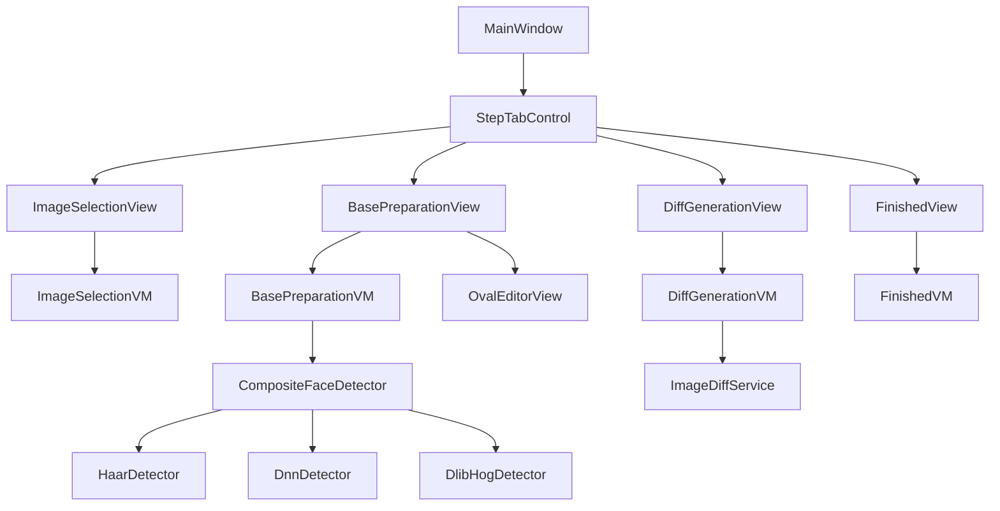

# FaceDiff WPF Application

## Architecture

- **Target**: .NET Framework 4.8, WPF
- **Pattern**: Vanilla MVVM (hand-rolled `ViewModelBase`, `RelayCommand` -- avoids framework version issues on .NET Framework 4.8)
- **Face Detection**: Emgu CV (Haar + DNN) and DlibDotNet (HOG) -- run all three, pick best by confidence/face-area score
- **Diff Output**: Transparent PNG -- only differing pixels within the oval are visible




## Project Structure

```
FaceDiff/
  FaceDiff.sln
  FaceDiff/
    FaceDiff.csproj
    packages.config
    App.xaml / App.xaml.cs
    MainWindow.xaml / MainWindow.xaml.cs
    Core/
      ViewModelBase.cs        (INotifyPropertyChanged)
      RelayCommand.cs         (ICommand)
      ObservableObject.cs
    Models/
      BaseImageModel.cs       (path, oval, status, matched comparisons)
      ComparisonImageModel.cs  (path, assigned base image)
      OvalRegion.cs           (center, radii, angle)
      FaceDetectionResult.cs  (rect, confidence, detector name)
      ProcessResult.cs        (base image, accepted/denied, diff count)
    ViewModels/
      MainViewModel.cs        (step navigation, step enable/disable logic)
      ImageSelectionViewModel.cs
      BasePreparationViewModel.cs
      OvalEditorViewModel.cs
      DiffGenerationViewModel.cs
      FinishedViewModel.cs
    Views/
      ImageSelectionView.xaml
      BasePreparationView.xaml
      OvalEditorView.xaml
      DiffGenerationView.xaml
      FinishedView.xaml
    Services/
      IFaceDetector.cs
      HaarFaceDetector.cs     (Emgu CV Haar cascade)
      DnnFaceDetector.cs      (Emgu CV DNN with res10 SSD)
      DlibHogFaceDetector.cs  (DlibDotNet HOG)
      CompositeFaceDetector.cs (runs all, picks best)
      ImageDiffService.cs     (pixel diff within oval, threshold + exact)
      ThumbnailService.cs     (async thumbnail generation)
    Controls/
      OvalEditorControl.xaml  (interactive oval draw/resize)
    Converters/
      BoolToVisibilityConverter.cs
      InverseBoolToVisibilityConverter.cs
      StatusToColorConverter.cs
    Resources/
      Styles.xaml             (step tab styles, grid list styles, responsive)
      haarcascade_frontalface_default.xml (embedded)
```

## NuGet Packages

- `Emgu.CV` (4.9.0) + `Emgu.CV.runtime.windows` -- OpenCV face detection (Haar + DNN)
- `DlibDotNet` (19.21.x) + `DlibDotNet.Extensions` -- HOG face detection
- No MVVM framework needed

## Key Implementation Details

### Step Navigation (MainViewModel)

`MainViewModel` holds an `ObservableCollection<StepViewModel>` and an `int CurrentStepIndex`. Each step exposes `bool IsCompleted` which triggers `IsEnabled` on the next step's tab. The tab bar is a styled `TabControl` where `TabItem.IsEnabled` is bound to the previous step's `IsCompleted`.

### Step 1: Image Selection

- Two `TextBox` + `Button` (folder browser) pairs for base and comparison folders
- Substring filter `TextBox` for base images
- Regex pattern `TextBox` -- the regex is applied to **both** base and comparison filenames; images are matched when their **first capture group** produces the same value
- Both filters are applied on demand via an **Apply** button (not live/realtime)
- Two side-by-side `ItemsControl` in `ScrollViewer` with `UniformGrid` panels for thumbnails
- Color-coded highlights: each unique match group gets a distinct color from a palette; clicking a base image highlights its matched comparison images
- Step is complete when all comparison images are matched with a base image

### Step 2: Base Image Preparation

- `CompositeFaceDetector` runs all three detectors in parallel (`Task.WhenAll`), selects result with highest `confidence * face_area` score
- Thumbnails cropped to detected face region + oval overlay drawn with `System.Drawing`
- Status indicators: green (auto-detected), red (no face found), yellow (manual override)
- **Oval Size slider** (range 80%–200%, default 130%): uniformly scales the radii of all auto-detected ovals. The raw detector oval is stored on `BaseImageModel.DetectedOval`; changing the slider recomputes `Oval` and regenerates face thumbnails. Manual ovals are not affected by the slider.
- Manual oval editor: `OvalEditorControl` -- mouse down starts oval center, drag sets radii. Edge handles for resize. After placing oval, view zooms to oval bounds for precision adjustment. Confirm/cancel buttons.
- Step complete when all base images have an oval (auto or manual)

### Step 3: Diff Generation

- Destination folder `TextBox` + browse button. **Validated**: destination path must differ from the comparison images source folder; an inline error message is shown and Start is disabled when they match.
- Start button triggers async processing per base image
- Split view: left shows base image with oval overlay, right shows `ItemsControl` grid filling with diff results as they complete
- **Output naming**: Each generated diff image is named identically to its source comparison image (e.g. comparison `face_001.png` → diff `face_001.png`). Accepted files are placed in `{destination}/{baseImageName}/`, so no collision between base groups.
- **Diff algorithm**: For each comparison image assigned to a base image:
  1. Align comparison image to base image coordinate space
  2. For each pixel inside the oval: compute Euclidean RGB distance
  3. If distance > threshold (or any difference in exact mode): output pixel with full alpha
  4. Otherwise: output transparent pixel (alpha = 0)
  5. Save as 32-bit ARGB PNG
- Threshold is configurable via a `Slider` (0 = exact, up to 100)
- Per base image: Accept (saves diffs to destination) or Deny (skips, flags for retry)
- After all base images processed, auto-navigate to Step 4

### Step 4: Finished

- Summary statistics: total base images, total comparisons processed, accepted count, denied count
- List of processed base images with accept/deny status
- "Retry Denied" button: filters to denied base images, navigates back to Step 2 with only those images, and repeats Steps 2-4

### Responsive UI

- Root layout uses `Grid` with star-sized rows/columns (`*`, `Auto`)
- `MinWidth`/`MinHeight` on key containers to prevent collapse at small sizes
- Thumbnail grid uses `UniformGrid` with column count computed from `ActualWidth` (binding via `SizeChanged` handler or `MultiBinding`)
- `ScrollViewer` with virtualization (`VirtualizingStackPanel`) on all image lists for performance
- Tested target resolutions: 3440x1440, 3440x2560, 1920x1080 -- no hardcoded pixel dimensions, all proportional

### DNN Model Files

The Caffe SSD face model (`res10_300x300_ssd_iter_140000.caffemodel` + `deploy.prototxt`) and the Dlib shape predictor will be downloaded on first run if not present, stored in an `AppData/FaceDiff/models` directory. A progress indicator is shown during download.